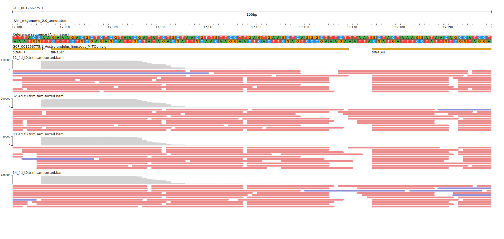

##  Summary
This workflow demonstrates the mitosRNAseq pipeline which identifies several types of
small RNA from sequencing data from short reads of <50 nt. The following method collects sequence-based 
counts, sequence locations, genomic features, and annotations. 
The data we use is from killifish embyros anoxia experiments. 

The step-by-step workflow we follow is illistrated below and a 
detailed method to perform small RNA seq on an academic HPC is decsribed in this document. 


The following table shows the contents of the file **samples.csv** that contains metadata for our samples.
We start with a total of 40 fastq files.

### Sample Table
```{r echo=FALSE, results='asis', warning=FALSE}
library(knitr)
library(readr)
library(formattable)
library(readr)
df_samples <- read_csv("samples.csv", show_col_types = FALSE)
formattable(df_samples,
        table.attr = 'style = "width:50%; font-size:90%;"'
        )
```

## QC for raw reads

Quality Control (QC) is done by running fastQC on raw reads to evaluate how good (or bad) our data looks.

### Install software for Quality Check

**conda**

Set up a virtual environment in conda that has all of the Quality Control (QC) tools. 
We are using [Miniconda](https://docs.anaconda.com/miniconda/). 
For creating sharable environments, create .yaml files for each environment you're making.

```
conda create -n condafastqc fastqc
conda activate condafastqc
conda install -n multiqc
```

**tmux**

For almost every long-ish process, 
we use tmux to run tasks in a detached terminal window that can keep running if we want to log out or if we accidently log out.
```
tmux new -s fastqc
```

### Executing

Creating a new file called **fastqcr.R** that has the script to run fastqc through R.
We use this script to automate the process for a list of files in a directory. 
Running commands through various scripts also keeps a record of our commands.

```
if (!require("fastqcr")) {
        install.packages("fastqcr", repos="http://cran.us.r-project.org")
        library(fastqcr)
} else {library(fastqcr)}
fastqc(fq.dir="/path/to/directory/init_fastq_files",
      qc.dir="/path/to/directory/fastqc/init_fastqc",
      threads=20)
```

Running the script with the following command:
```
Rscript fastqcr.R
```
Press `Ctrl+B` and then `D` for detaching this tmux window. 
You can log out from your remote computer (HPC) and close your terminal 
window now while this process keeps running on your remote computer. 
To get back to this window, log in to your remote computer, and
 use the command `tmux a -t fastqc`. F
or more information, check [tmux](https://github.com/tmux/tmux/wiki/Getting-Started). 

We will get a fastqc HTML file in the output fastqc directory for 
each fastq sequence in the input init_fastq_files directory.

### FastQC Output

**General Statistics from multiqc**
```{r echo=FALSE, results='asis', warning=FALSE}
library(readr)
library(formattable)
df_stats <- read_tsv("multiqc_init_fastq/general_stats_table.tsv", show_col_types = FALSE)
is.num <- sapply(df_stats, is.numeric)
df_stats[is.num] <- lapply(df_stats[is.num], round, 1)
formattable(df_stats, list(
    'PercentDups' = color_bar("#E9967A"),
    'PercentGC' = color_bar("#DAA520"),
    'BPMedianReadLength' = color_bar("#66CDAA"),
    'MillionsSeqs' = color_bar("#DA70D6")),
    table.attr = "class=\'table table-condensed\', style=\'width:80%; font-size:90%;\'"
)
```

**Sequence Counts for each sample**

{width=550px}

**The mean quality scores per base in the read**

{width=550px}

**The average quality scores per sequence**

{width=550px}

**The GC content per sequence**

{width=550px}


**Sequence Duplication**

{width=550px}

**Overrepresented sequences**

{width=550px}

**Adapter Content**

{width=550px}

**Overall Pass/Fail**

{width=550px}

**Sequence length distribution**

All samples had sequences of a single length (50bp , 36bp , 101bp).

## Trimming

Trimming is done with Trimmomatic in our case, however, other tools like cutadapt or fastp may also be used.
This tool runs through the following bash script

```
FILES="/disk/bioscratch/Podrab_lab/gazal/sRNA_gazal/copied_old_infiles/init_fastq_files/*.fastq.gz"
for f in $FILES
    do
        b=`basename $f`
        echo Running trimming for the file $b

        c=${b::-9}
        o="$c.trim.fastq"
	log="$c.out.log"
        c="$c.log.txt"
        java -jar /disk/bioscratch/Podrab_lab/gazal/sRNA_gazal/trim/Trimmomatic-0.39/trimmomatic-0.39.jar SE -threads 20 -phred33 -trimlog $c $f $o ILLUMINACLIP:/disk/bioscratch/Podrab_lab/gazal/sRNA_gazal/copied_old_infiles/adapter_contamination_sequences_AR3.txt:2:30:5:1:true SLIDINGWINDOW:5:15 LEADING:20 TRAILING:20 MINLEN:15 2> $log
    done
```

{width=550px}

```{r echo=FALSE, results='asis', warning=FALSE}
library(readr)
library(formattable)
df_stats <- read_tsv("trimmomatic/trimmomatic_plot.tsv", show_col_types = FALSE)
is.num <- sapply(df_stats, is.numeric)
df_stats[is.num] <- lapply(df_stats[is.num], round, 1)
formattable(df_stats, list(
    'TotalReads' = color_bar("#BDB76B"),
    'SurvivingReads' = color_bar("#90EE90"),
    'PercentSurviving' = color_bar("#32CD32"),
    'DroppedReads' = color_bar("#F08080"),
    'PercentDropped' = color_bar("#CD5C5C")),
    table.attr = "class=\'table table-condensed\', style=\'width:100%; font-size:90%;\'"
)
```
				

## QC for trimmed reads

Quality Control (QC) is done for the trimmed reads with fastQC. 
We activate the conda environment `condafastqc` for this process.

```
if (!require("fastqcr")) {
        install.packages("fastqcr", repos="http://cran.us.r-project.org")
        library(fastqcr)
} else {library(fastqcr)}
fastqc(fq.dir="/path/to/directory/trimmed_fastq_files",
      qc.dir="/path/to/directory/fastqc/trim_fastqc",
      threads=20)
```

Running the script with the following command:
```
Rscript fastqcr.R
```

### FastQC Output

Plots for each FASTQC metric after trimming is shown below. 
All the adapters were removed and overall quality looks better.

**General Statistics from multiqc**
```{r echo=FALSE, results='asis', warning=FALSE}
library(readr)
library(formattable)
df_stats <- read_tsv("multiqc_trim_fastq/general_stats_table.tsv", show_col_types = FALSE)
is.num <- sapply(df_stats, is.numeric)
df_stats[is.num] <- lapply(df_stats[is.num], round, 1)
formattable(df_stats, list(
    'PercentDups' = color_bar("#E9967A"),
    'PercentGC' = color_bar("#DAA520"),
    'BPMedianReadLength' = color_bar("#66CDAA"),
    'MillionsSeqs' = color_bar("#DA70D6")),
    table.attr = "class=\'table table-condensed\', style=\'width:80%; font-size:90%;\'"
)
```
**Sequence Counts for each sample**

{width=550px}

**The mean quality scores per base in the read**

{width=550px}

**The average quality scores per sequence**

{width=550px}

**The GC content per sequence**

{width=550px}


**Sequence Duplication**

{width=550px}

**Overrepresented sequences**

{width=550px}

**Overall Pass/Fail**

{width=550px}

**Sequence length distribution**

{width=550px}

## Alignment

The trimmed reads are aligned to the reference genome using bowtie.
To analyze reads mapping with mitochondrial genome, we perform the alignment in two steps.

1. Complete Genome (with mitochondrial genome)- with algenome.fa
2. Only the Mitochondrial genome which is extracted from genome.fa- almitogenome.fa

To begin alignment, we make bowtie indexes, this is done in two sets.

```
bowtie-index algenome.fa
bowtie-index almitogenome.fa
```

### Alignment with genome

The alignment was done on the trimmed reads from previous section.

```
#!/bin/bash
FILES="/disk/bioscratch/Podrab_lab/gazal/sRNA_gazal/trim/*.fastq"
for f in $FILES
    do
        b=`basename $f`
        echo Running trimming for the file $b
        t=${b::-6}
        o="$t.sam"
        uo="$t.mapped.fq"
        echo Output file is $o
        bowtie \
	 -p 20 \
     	 -t \
	 -k 5 \
	 --best \
	 --strata \
	 -e 99999 \
	 -v 0 \
   	 -l 15 \
  	 --chunkmbs 2048 \
	 -x /disk/bioscratch/Podrab_lab/gazal/sRNA_gazal/bowtie_index_alim/algenome \
	 -q $f \
	 --al $uo \
	 --sam --no-unal > $o 2> $t.bowtie.log
    done
#done
```

The following stats show alignment QC. 

{width=550px}

This table shows the number of reads aligned in each sample (MillionAlignedReads). 
It also shows the number of aligments of various reads that includes multimapped reads (MillionMappedReads).

```{r echo=FALSE, results='asis', warning=FALSE}
library(readr)
library(formattable)
df_stats <- read_tsv("alignment/genome/general_stats_table.tsv", show_col_types = FALSE)
is.num <- sapply(df_stats, is.numeric)
df_stats[is.num] <- lapply(df_stats[is.num], round, 1)
formattable(df_stats, list(	
    'PercentAligned' = color_bar("#B0C4DE"),
    'MillionAlignedReads' = color_bar("#E6E6FA"),
    'MillionMappedReads' = color_bar("#778899"),
    table.attr = "class=\'table table-condensed\', style=\'width:80%; font-size:90%;\'")
)
```
### Alignment with mitochondria

The alignment was done on the trimmed reads from previous section.

The following stats show alignment QC. 

```
#!/bin/bash
FILES="/disk/bioscratch/Podrab_lab/gazal/sRNA_gazal/trim/*.fastq"	
for f in $FILES
    do
        b=`basename $f`
        echo Running alignment for the file $b
        t=${b::-6}
        o="$t.sam"
	uo="$t.mapped.fq"
        echo Output file is $o
        bowtie \
	 -p 20 \
     	 -t \
	 -k 10 \
	 --best \
	 --strata \
	 -e 99999 \
	 -v 0 \
   	 -l 15 \
  	 --chunkmbs 2048 \
	 -x /disk/bioscratch/Podrab_lab/gazal/sRNA_gazal/bowtie_mito_index/almitogenome \
	 -q $f \
	 --al $uo \
	 --sam --no-unal > $o 2> $t.bowtie.log
    done
#done
```

{width=550px}

This table shows the number of reads aligned in each sample (MillionAlignedReads). 
It also shows the number of aligments of various reads that includes multimapped reads (MillionMappedReads).

```{r echo=FALSE, results='asis', warning=FALSE}
library(readr)
library(formattable)
df_stats <- read_tsv("alignment/mitochondria/general_stats_table.tsv", show_col_types = FALSE)
is.num <- sapply(df_stats, is.numeric)
df_stats[is.num] <- lapply(df_stats[is.num], round, 2)
formattable(df_stats, list(	
    'PercentAligned' = color_bar("#B0C4DE"),
    'MillionAlignedReads' = color_bar("#E6E6FA"),
    'MillionMappedReads' = color_bar("#778899"),
    table.attr = "class=\'table table-condensed\', style=\'width:80%; font-size:90%;\'")
)
```

## Using aligned reads
**Coming Soon**

### miRTrace
 Running mirtrace with the following command.
```
#!/bin/bash
mirtrace qc --species dre --config seq_address.txt
```

Looking at the results:

{width=100%}
{width=100%}

### sports

Executing sports tool on mapped reads only. We use the following command to run:

```
#!/bin/bash
sports.pl -i seqs_alim_mito.txt \
-o /disk/bioscratch/Podrab_lab/gazal/sRNA_gazal/align_with_alimnaeus/gen_input_fastq/SPORTS/out_sports/REDO/mito_mapped_reads \
-k \
-M 2 \
-p 20 \
-g /disk/bioscratch/Podrab_lab/gazal/sRNA_gazal/bowtie_mito_index/almitogenome \
-m /disk/bioscratch/Podrab_lab/gazal/sRNA_gazal/align_with_alimnaeus/gen_input_fastq/SPORTS/sports1.1/db/Danio_rerio/miRBase_21/miRBase_21-dre \
-r /disk/bioscratch/Podrab_lab/gazal/sRNA_gazal/align_with_alimnaeus/gen_input_fastq/SPORTS/sports1.1/db/Danio_rerio/rRNA_db/zebrafish_rRNA \
-t /disk/bioscratch/Podrab_lab/gazal/sRNA_gazal/align_with_alimnaeus/gen_input_fastq/SPORTS/sports1.1/db/Danio_rerio/GtRNAdb/danRer6-tRNAs \
-w /disk/bioscratch/Podrab_lab/gazal/sRNA_gazal/align_with_alimnaeus/gen_input_fastq/SPORTS/sports1.1/db/Danio_rerio/piRBase/piR_dre_v1.0 \
-e /disk/bioscratch/Podrab_lab/gazal/sRNA_gazal/align_with_alimnaeus/gen_input_fastq/SPORTS/sports1.1/db/Danio_rerio/Ensembl/Danio_rerio.GRCz10.ncrna \
-f /disk/bioscratch/Podrab_lab/gazal/sRNA_gazal/align_with_alimnaeus/gen_input_fastq/SPORTS/sports1.1/db/Danio_rerio/Rfam_12.3/Rfam-12.3-zebrafish
```

This will generate a number of output files, from which the tables
generated as a result file *_output.txt for each sample are taken and 
are used to extract annotation of mapped reads.
Top 50 rows of this table are shown for the sample 10_12d_4hrA below. 


{width=550px}

It also generates a number of plots to categorize the annotations 
and their length distributions for each sample.

{width=550px}
{width=550px}

## Compiling output files
**Coming Soon**

## Visualizing
We use the alignments with mitochondrial genome to view the aligned reads.

Jbrowse is used to explore alignments.

Files used:

1. Aligned bam files for each sample and its corresponding index file (bam, bai)
3. Reference genome for mitochondria (.fasta) and its index file (.fai)
4. Genome feature file (.gff) for mitochondrial genome


<a href="jbrowse/jbrowse_4d_t0.svg" target="_blank"> Click to enlarge</a>

This figure shows mitochondiral genome of 100bp length from 17100 to 17199. On this genome, we see 
1) the colored basepairs, 2) Genomic features of the mentioned length, 3) Alignments from 4 samples (4d t0 replicates)
that show reads aligned to the genome colored by strand while also showing the coverage histogram in grey. 